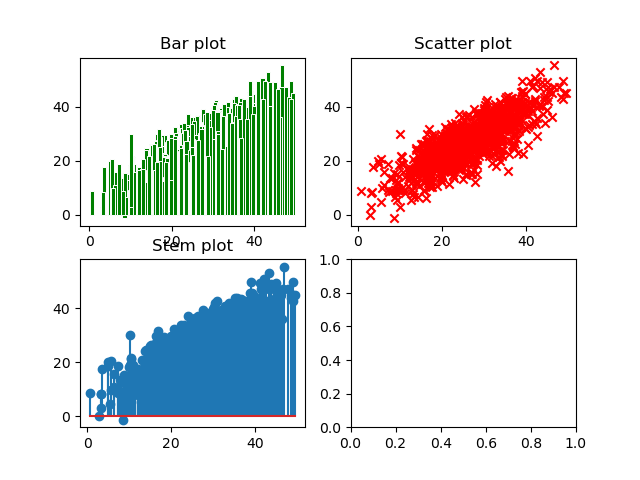
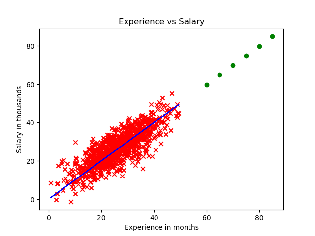

# Задание:

1. Создать или загрузить таблицу с данными для аппроксимации и прогноза. Постарайтесь подобрать данные, связанные с вашей основной специальностью или научной работой.

2. Построить три различных аналитических графика с помощью библиотеки matplotlib.

3. Написать функции, вычисляющие коэффициенты m и c линейной регрессии методом наименьших квадратов, по загруженным/созданным данным.

4. Вывести линию тренда, полученную с помощью МНК.

5. Расширить список значений x и спрогнозировать значения y с помощью полученной линии тренда. Результат отобразить на отдельном графике.

# Exercise:

1. Create or load a table with data for approximation and forecast. Try to select data related to your major specialty or scientific work.

2. Construct three different analytical graphs using the matplotlib library.

3. Write functions that calculate the coefficients m and c of linear regression using the least squares method using the loaded/created data.

4. Draw the trend line obtained using least squares method.

5. Expand the list of x values and predict y values using the resulting trend line. The result is displayed on a separate graph.

# Result/ Результат:

